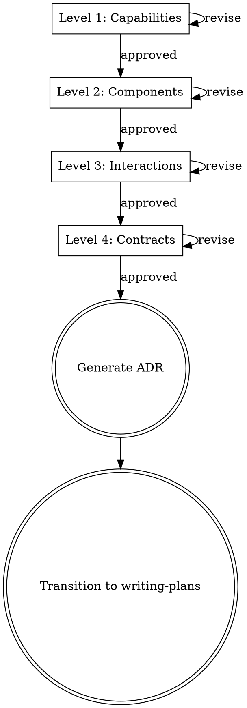

# Architectural Design First

Structured architectural decomposition in four levels, each requiring user approval before proceeding. No code until contracts are agreed. After approval, decisions are captured as an ADR.

**Position in workflow:** After brainstorming (what to build) → **this skill** → writing-plans (implementation steps)

## Process Flow

<HARD-GATE>
Each level MUST be presented separately and approved before moving to the next. Do NOT combine levels, skip levels, or present code at any level. The only code-like artifacts allowed are type signatures at the Contracts level.
</HARD-GATE>

## The Four Levels

### Level 1: Capabilities

**Question:** What does this feature need to DO?

List concrete capabilities from the user's perspective. No technical decisions — just what the system must be able to do. Bulleted list, each starting with a verb.

**Ask:** "Are these the right capabilities? Anything missing or unnecessary?"

### Level 2: Components

**Question:** What pieces do we need to build?

Identify components — services, storage, endpoints — and where they live in the existing architecture. Reference real files and patterns from the codebase. Table or structured list with responsibilities and locations.

**Include:** Which modules/layers, new vs modified components, storage decisions
**Exclude:** Method signatures (→ Contracts), data flow (→ Interactions)

**Ask:** "Does this component breakdown make sense?"

### Level 3: Interactions

**Question:** How do the components talk to each other?

Describe data flow and integration points. How does a request travel through the system? Numbered steps for each key operation.

**Include:** Request/response flows, event/trigger mechanisms, layer-by-layer data flow
**Exclude:** Type definitions (→ Contracts), file locations (→ Components)

**Ask:** "Do these interaction flows look right?"

### Level 4: Contracts

**Question:** What are the exact interfaces between components?

Type signatures, DTOs, API shapes, and interfaces. This is the most concrete level before code.

**Include:** API endpoints (method, path, request/response), service interfaces, DAO methods, domain types, DTO shapes
**Ask:** "Do these contracts look right? Once approved, I'll generate an ADR and move to implementation planning."

## Rules

**One level per message.** Present one level, ask for approval, wait. Do not preview the next level.

**Abstract before concrete.** Capabilities → Components → Interactions → Contracts. Never jump ahead.

**Read the codebase first.** Before presenting Components, read existing code to ground your design in real patterns. Mirror what exists — don't invent conventions.

**No code until contracts are agreed.** Type signatures at Contracts are the closest thing to code allowed.

## Red Flags — You Are Violating This Skill

| Rationalization | Reality |
|----------------|---------|
| "Time pressure means we should combine levels" | Combined levels get rubber-stamped. Separate levels get real feedback. |
| "This feature is simple enough to skip Capabilities" | Simple features have the most unexamined assumptions. |
| "The user already described the capabilities" | Restate them — the user's description and your understanding may differ. |
| "Components are obvious from the capabilities" | Obvious to you. Present them and let the user confirm. |
| "I'll present everything and ask for feedback at the end" | Feedback on a wall of text is always "looks fine." Incremental review catches real issues. |

## After All Four Levels Are Approved: Generate ADR

Once all four levels are approved, generate an Architecture Decision Record.

### Step 1: Ask target repo

Ask the user: "Which repo's `<repo>/docs/adr/` should I save the ADR to?"

If the user works across multiple repos (e.g., a frontend and a backend), ask whether the ADR should be saved to one or both — and if both, adapt the ADR content to each repo's perspective.

### Step 2: Auto-detect ADR number

For the target repo, list `docs/adr/` to find the highest existing number. The new ADR gets the next number (e.g., if `002-*.md` exists, create `003-*.md`). Create `docs/adr/` if it doesn't exist.

### Step 3: Generate ADR

Follow the template in `references/adr-template.md`. Map design levels to ADR sections:

| ADR Section | Source |
|---|---|
| **Context** | Level 1 (Capabilities) — what we need and why |
| **Architecture Overview** | Levels 2+3 — Mermaid flowchart showing component relationships and data flow |
| **Key Decisions** | Extracted from all levels — the "why" behind each choice, with alternatives and trade-offs |
| **Appendix** | Collapsible `
` with the full 4-level design as presented and approved |

### Step 4: Save and transition

Save the ADR file(s), then transition to `superpowers:writing-plans` for implementation planning.
