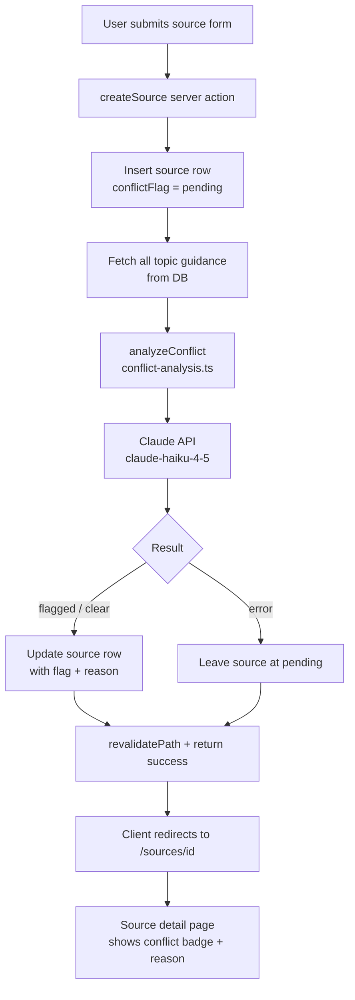

# ADR-001: AI-Assisted Conflict Flagging for Submitted Sources

## Status

Proposed

## Context

When ambulance personnel submit debrief reports or research findings, topic owners need a fast way to identify whether the new material may contradict or challenge existing operational guidance. Without automated triage, reviewers must read every source in full before knowing if action is needed.

**Requirements:**

- Compare a submitted source's content against all existing topic guidance texts
- Detect potential contradictions or challenges to current guidance
- Store a conflict flag (`pending`, `flagged`, `clear`) and a short reason on the source record
- Display the conflict state on the source detail view immediately after submission
- Trigger the analysis automatically on submission — no manual action required from the reviewer
- Degrade gracefully: a failed AI call leaves the source in `pending` state rather than blocking submission

## Architecture Overview



## Key Decisions

### 1. Conflict state stored directly on the `sources` row

**Decision:** Add `conflictFlag` and `conflictReason` columns to the `sources` table rather than a separate conflict table.

**Alternatives considered:**
- A separate `source_conflicts` join table linking sources to specific conflicting topics
- A `source_analysis` side-table for all AI-generated metadata

**Why:** Story 14 requires marking and displaying a single conflict state per source. A join table is premature — no story requires knowing *which* topic produced the conflict flag at the row level. The reason text can carry that information in prose.

**Trade-off:** If a future story needs to link conflicts to specific topics (e.g., story 15 — change proposals), the reason text is not machine-readable. At that point, a join table or structured JSON column can be introduced.

---

### 2. Analysis triggered synchronously inside the server action

**Decision:** Call `analyzeConflict` inside `createSource` after the DB insert, before returning to the client.

**Alternatives considered:**
- Background job / queue (e.g., a separate API route polled by the client)
- A separate "run analysis" button on the source detail page

**Why:** Next.js Server Actions run on the server and can await async work. Keeping it synchronous avoids introducing a job queue (not in the stack) and means the conflict state is ready by the time the user lands on the detail page in the common case.

**Trade-off:** Submission latency increases by the Claude API round-trip (~1–3 s). Mitigated by: (a) graceful degradation on timeout/error leaves the source saved regardless, and (b) `pending` state is displayed if analysis hasn't resolved.

---

### 3. Model choice: `claude-haiku-4-5-20251001`

**Decision:** Use `claude-haiku-4-5-20251001` for the conflict analysis prompt.

**Alternatives considered:**
- `claude-sonnet-4-6` — higher quality but slower and more expensive per call
- Embedding-based similarity search (no LLM call)

**Why:** Conflict detection is a classification task with a short structured output. Haiku is fast enough to stay within acceptable submission latency and cheap enough to run on every source submission. Sonnet can be substituted if output quality proves insufficient.

**Trade-off:** Haiku may miss subtle conflicts or produce imprecise reasons for complex clinical material. The flag is labelled a *possible* conflict — human review is always required before action is taken.

---

### 4. `pending` as a safe default, not an error state

**Decision:** The `conflictFlag` column defaults to `"pending"` and the source is always saved before the AI call.

**Alternatives considered:**
- Blocking submission until analysis completes
- Saving the source only after a successful AI response

**Why:** Source submission and conflict analysis are separate concerns. A transient API failure should not lose the submitted source. The UI can show a "pending" badge and the reviewer knows to check back.

**Trade-off:** There is no automatic retry for `pending` sources. A future story could add a retry mechanism or an admin trigger; for now, `pending` is a visible signal that prompts manual follow-up if needed.

## Appendix: Design Levels

<details>
<summary>Full design conversation (click to expand)</summary>

### Level 1: Capabilities

- **Compare** a submitted source's content against one or more topic's current guidance text
- **Detect** whether the source's content may contradict, challenge, or undermine existing guidance
- **Store** a conflict flag (possible conflict / no conflict) alongside a short human-readable reason for the flag
- **Display** the conflict state on the source detail view so a topic owner can immediately see whether a flag was raised
- **Show** the short reason for the flag so the reviewer understands what triggered it
- **Trigger** the analysis automatically when a source is submitted, without requiring manual action from the reviewer

### Level 2: Components

| Component | Type | Location | New or Modified |
|---|---|---|---|
| `sources` table | Storage | `src/db/schema.ts` | Modified — add `conflictFlag` and `conflictReason` columns |
| DB migration | Migration | `drizzle/` | New |
| Conflict analysis module | AI service | `src/app/_lib/conflict-analysis.ts` | New |
| `createSource` server action | Server action | `src/app/source-actions.ts` | Modified |
| Source detail page | UI | `src/app/sources/[id]/page.tsx` | Modified |

### Level 3: Interactions

**Operation 1: Submit a source**

1. User submits the new source form
2. `createSource` validates with Zod, inserts row with `conflictFlag = 'pending'`
3. `createSource` fetches all topic guidance texts from the DB
4. Calls `analyzeConflict(sourceContent, allTopics)` → Claude API → returns flag + reason
5. Updates the source row with the result; calls `revalidatePath`; returns `{ success: true, id }`
6. Client redirects to `/sources/<id>`

If the Claude API call fails, the source is left at `pending` and submission still succeeds.

**Operation 2: View conflict state**

1. Browser GETs `/sources/<id>`
2. Server Component queries the source row including `conflictFlag` and `conflictReason`
3. Page renders a conflict badge and (if flagged) the reason text

### Level 4: Contracts

**Schema additions:**
```ts
export const conflictFlagEnum = pgEnum("conflict_flag", ["pending", "flagged", "clear"]);

// On sources table:
conflictFlag: conflictFlagEnum("conflict_flag").notNull().default("pending"),
conflictReason: text("conflict_reason"),
```

**Conflict analysis module:**
```ts
type TopicContext = { id: string; title: string; guidance: string };
type ConflictAnalysisResult = { flag: "flagged" | "clear"; reason: string };

async function analyzeConflict(
  sourceContent: string,
  topics: TopicContext[]
): Promise<ConflictAnalysisResult>
```

**`createSource` return type:** unchanged — `Promise<CreateSourceState>`

**Source detail page select:** adds `conflictFlag: sources.conflictFlag, conflictReason: sources.conflictReason`

</details>
