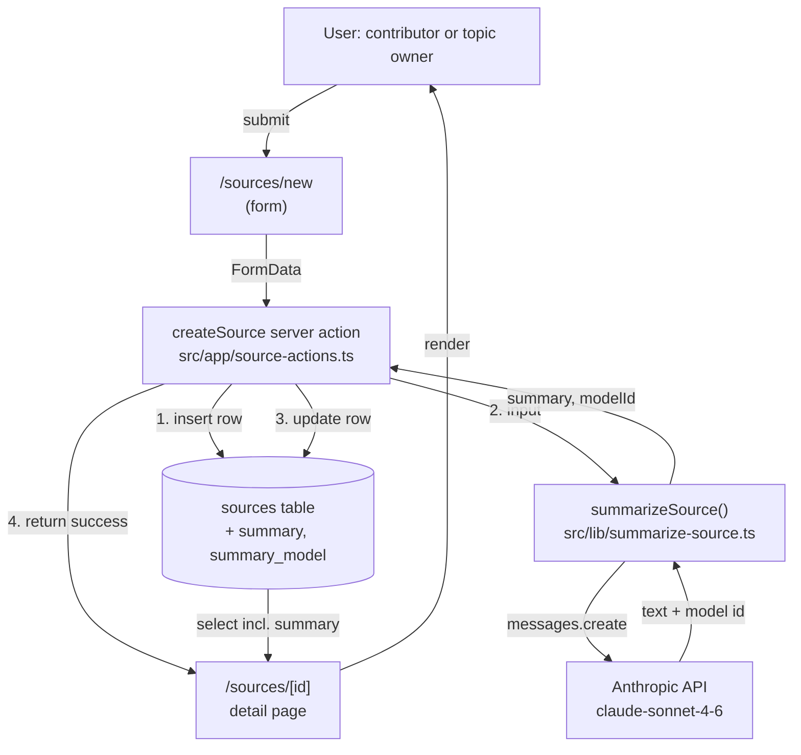

# ADR-002: AI-generated source summaries

## Status

Proposed

## Context

Paramedic Learnings is a knowledge platform where ambulance personnel submit sources (debrief reports, research findings, guidelines, incident reports) that feed into operational guidance. Topic owners are the bottleneck: they must read every incoming source in full before deciding whether it warrants updating a topic. Story 12 addresses this by giving each source an AI-generated summary so triage is faster.

**Requirements** (from Level 1 Capabilities):

- Generate a 3–4 bullet summary of a source's content using an LLM (Claude).
- Store the summary alongside the source so it isn't regenerated on each view.
- Show that the summary is system-generated, including which model produced it (provenance).
- Display the summary on the source detail page, distinct from the raw content.
- Generate automatically on source submission — no manual "summarize" click for the happy path.
- Submission must succeed even if the LLM is slow or unavailable; the source remains viewable.
- Cover all four source types with one mechanism. Keep the implementation simple — no manual regeneration, no background queue, no separate table.

## Architecture Overview



The submit action is synchronous end-to-end: it inserts the source, calls the LLM, updates the row with the summary, and only then returns success. The client navigates to the detail page once the action returns. A try/catch around the LLM call ensures that submission still succeeds (with a null summary) if Claude is unavailable.

## Key Decisions

### 1. Add columns to `sources`, not a new `source_summaries` table

**Decision:** Two nullable columns on the existing `sources` table — `summary text` and `summary_model text`. Reuse `sources.created_at` as the summary timestamp; no separate `summary_generated_at`.

**Alternatives considered:**
- A separate `source_summaries` table with a foreign key to `sources`.

**Why:** The relationship is 1:1 in v1 with no history needed. A separate table buys nothing but a join. The omitted `summary_generated_at` column would always equal `sources.created_at` in v1 (summaries are never re-generated), so it's dead weight.

**Trade-off:** If we ever support manual regeneration or multiple summaries per source, we'll need to migrate — either back-filling a generated-at column or extracting to a child table. Acceptable: that migration is mechanical, and YAGNI applies until the feature is real.

### 2. Synchronous LLM call inside the submit action

**Decision:** Call `summarizeSource()` inside `createSource`, before returning to the client. The user waits for the LLM to respond on submit, then lands on the detail page with the summary already populated. Actual latency depends on content length and provider response time and will be measured once implemented.

**Alternatives considered:**
- Next.js `after()` API to run the LLM call after the response is sent (non-blocking).
- Lazy generation on first detail-page view (server component generates if missing).
- Background queue / worker.

**Why:** Simplest model. No race conditions, no "summary not yet available, refresh in 5s" UX, no new infra. For a course demo a perceptible submit pause is acceptable and arguably *better* — it makes the AI step legible to the user.

**Trade-off:** Slower form submission than `after()`. Mitigated by capping `max_tokens` and choosing Sonnet 4.6 (not Opus). If submit latency becomes a real problem, switching to `after()` is a contained server-side change — the summarizer module and schema don't move — but the detail page would then need to handle "summary not yet written" (a generating-state placeholder, plus polling or revalidation), since the client could land there before the row is updated. Not a one-file change once the UX is honest.

### 3. Failure isolation via try/catch — submission must always succeed

**Decision:** Wrap the LLM call (and the follow-up update) in try/catch inside the action. On error: log and continue. The source row is already committed; the summary stays null and the detail page shows "Summary not available."

**Alternatives considered:**
- Let the LLM error bubble up and fail the submission.

**Why:** A clinician submitting a debrief shouldn't lose their work because the LLM provider is down. The source is the durable artifact; the summary is an enhancement.

**Trade-off:** Sources with null summaries accumulate when the API is degraded and there's no automatic retry. Acceptable in v1; a later "retry summarization" job can fill these in if needed.

### 4. One parameterized prompt for all source types

**Decision:** A single system prompt instructing Claude to produce 3–4 bullets, with type-aware focus described inline ("if debrief, focus on events + learnings; if research, findings + applicability; if guideline, recommendations; if incident_report, events + outcomes"). The user message includes the source type as a field.

**Alternatives considered:**
- Four separate prompt templates, one per `sourceType`.

**Why:** One place to maintain. Claude reliably follows per-branch instructions in a single prompt. Splitting into four templates quadruples the surface area for prompt drift between types.

**Trade-off:** A future source type with very different needs (e.g., a 100-page document requiring chunking) might outgrow the single prompt. Easy to extract per-type prompts when that pressure is real.

### 5. Model: `claude-sonnet-4-6`

**Decision:** Default to Sonnet 4.6 for summarization. Store the exact model id returned by the API in `summary_model` (e.g., `claude-sonnet-4-5-20250929`) for provenance.

**Alternatives considered:**
- `claude-haiku-4-5-20251001` for speed and cost.
- `claude-opus-4-7` for maximum quality.

**Why:** A wrong summary on a clinical source could mislead a topic owner — this isn't trivial enough for Haiku per the project's stated model preference. Opus is overkill for a constrained-shape summarization task. Sonnet sits at the right capability/latency point.

**Trade-off:** Sonnet costs more and is slower than Haiku. Acceptable for v1 given the criticality of clinical accuracy. Cost and latency on real submission volumes are unmeasured; if either becomes a problem, downgrading to Haiku for low-stakes source types (or for an explicit "fast preview" path) is a small change to the summarizer module.

### 6. Source content is sent to Anthropic, unredacted

**Decision:** The full `content` (and `metadata`) of every submitted source is sent to the Anthropic API on submission. No redaction step, no on-prem inference, no opt-out flag.

**Note:** This decision was not raised during the original design conversation. It was added during ADR review.

**Alternatives considered:**
- A self-hosted open-weight model (e.g., a local Llama-class deployment).
- A pre-send redaction pass that strips identifiers from `content` before the API call.
- An opt-in "summarize this source" toggle on the submission form.

**Why:** This is a course-project demo with synthetic content. Setting up self-hosted inference or a redaction pipeline costs significant time and yields no real privacy benefit on test data. Sonnet also produces meaningfully better summaries on clinical free-text than current open-weight models we'd realistically self-host.

**Trade-off:** A real ambulance deployment would handle PHI under regulations the course environment doesn't simulate (HIPAA in the US, similar regimes elsewhere), and the current design would not be production-acceptable without a separate review covering: data-processing agreements with the LLM provider, data residency, redaction or de-identification of `content`, and audit logging of what is sent. **This ADR explicitly defers that review — v1 is a course demo, not a production system.** Anyone reusing this design outside the course must revisit Decision 6 before going live.

## Appendix: Design Levels

<details>
<summary>Full design conversation (click to expand)</summary>

### Level 1: Capabilities

- Generate a 3–4 bullet summary of a source's content using Claude.
- Store the generated summary alongside the source so it persists.
- Record that the summary is system-generated, including which model produced it.
- Display the summary on the source detail page, clearly labeled as AI-generated, distinct from raw content.
- Trigger summary generation automatically when a source is submitted.
- Handle generation failures gracefully — a source remains viewable (with raw content) even if summarization fails.
- Avoid blocking source submission on the LLM call — submitting a source must succeed even if Claude is slow or down.
- Cover all four source types (`debrief`, `research`, `guideline`, `incident_report`) via one mechanism.
- Scope: no manual regenerate button; no edit-summary UI.

### Level 2: Components

**New:**

| Component | Location | Responsibility |
|---|---|---|
| Source summarizer | `src/lib/summarize-source.ts` | Instantiates the Anthropic client at module scope; exports an async function that takes the source fields and returns `{ summary, modelId }`. Owns the prompt template. |

**Modified:**

| Component | Location | Change |
|---|---|---|
| DB schema | `src/db/schema.ts` | Add two nullable columns to `sources`: `summary text`, `summary_model text`. |
| Summary trigger | `src/app/source-actions.ts` | After insert, call summarizer and update the row with the result. Try/catch around the call. |
| Source detail page | `src/app/sources/[id]/page.tsx` | Render an "AI Summary" groupbox above the existing Content groupbox; show null-state when missing. |
| Env / deps | `.env.local`, `package.json` | `ANTHROPIC_API_KEY`, `@anthropic-ai/sdk`. |

**Deliberately not touched:** no separate `source_summaries` table, no queue, no list-page change, no edit/regenerate UI.

### Level 3: Interactions

**Flow 1 — Source submission → summary generated → source visible:**

1. User submits the form on `/sources/new`.
2. Server action `createSource` authenticates and validates with `CreateSourceSchema`.
3. Action inserts the new row with summary columns null; gets back `id`.
4. Action calls `summarizeSource({ title, sourceType, content, metadata })` inside try/catch.
5. On success: action updates the row with `summary`, `summary_model`. On failure: log and continue; summary stays null.
6. Action revalidates `/sources` and returns `{ success, id }`.
7. Client navigates to `/sources/{id}`.
8. Detail page renders the summary inline (or null-state).

**Flow 2 — Source detail render:**

1. User opens `/sources/{id}` (server component).
2. Page selects the source row joined to `users` plus the new summary columns.
3. If `summary` is non-null → render the "AI Summary" groupbox with bullets (pre-wrap text) and a provenance footer naming the model.
4. If null → render the groupbox with placeholder "Summary not available."

**Flow 3 — Inside `summarizeSource`:**

1. Build a single user message with source type, title, content, optional metadata. System prompt instructs Claude to produce 3–4 short bullets with type-aware focus.
2. Call `client.messages.create({ model: "claude-sonnet-4-6", max_tokens: 400, system, messages })`.
3. Extract the text from `response.content[0]` (assert `type === "text"`).
4. Return `{ summary, modelId: response.model }`.

### Level 4: Contracts

**Schema additions (`src/db/schema.ts`):**

```ts
export const sources = pgTable("sources", {
  // ... existing columns unchanged
  summary: text("summary"),
  summaryModel: text("summary_model"),
});
```

Both nullable. Generated migration in `drizzle/`. No backfill — existing sources stay null.

**Summarizer module (`src/lib/summarize-source.ts`):**

```ts
import type { Source } from "@/db/schema";

export type SummarizeSourceInput = Pick<
  Source,
  "title" | "sourceType" | "content" | "metadata"
>;

export interface SummarizeSourceResult {
  summary: string;   // newline-joined bullets, e.g. "- foo\n- bar\n- baz"
  modelId: string;   // exact model id returned by the API, stored verbatim
}

export async function summarizeSource(
  input: SummarizeSourceInput
): Promise<SummarizeSourceResult>;
// Throws on API error, missing API key, or empty/malformed response.
// Caller (createSource) is responsible for try/catch.
```

Model: `claude-sonnet-4-6`, `max_tokens: 400`. Prompt structure: system prompt with per-type focus instructions; user message structured as `Source type: …`, `Title: …`, optional `Metadata: …`, `Content: …`.

**Server action change (`src/app/source-actions.ts`):**

`CreateSourceState` shape unchanged. After the existing insert, add:

```ts
try {
  const { summary, modelId } = await summarizeSource({
    title: result.data.title,
    sourceType: result.data.sourceType,
    content: result.data.content,
    metadata: result.data.metadata ?? null,
  });
  await db
    .update(sources)
    .set({ summary, summaryModel: modelId })
    .where(eq(sources.id, inserted.id));
} catch (err) {
  console.error("[summarize-source] failed", { sourceId: inserted.id, err });
  // Submission still succeeds; summary stays null.
}
```

**Detail page query (`src/app/sources/[id]/page.tsx`):**

Add `summary: sources.summary, summaryModel: sources.summaryModel` to the existing select. Render branch:

```tsx
<div className="win-groupbox">
  <span className="win-groupbox-title">AI Summary</span>
  <div className="win-sunken" style={{ background: "#ffffff", padding: "6px 8px" }}>
    {row.summary ? (
      <>
        <p style={{ fontSize: "11px", whiteSpace: "pre-wrap", lineHeight: "1.6" }}>
          {row.summary}
        </p>
        <p style={{ fontSize: "10px", color: "#808080", marginTop: "6px", fontStyle: "italic" }}>
          Generated by {row.summaryModel}
        </p>
      </>
    ) : (
      <p style={{ fontSize: "11px", color: "#808080", fontStyle: "italic" }}>
        Summary not available.
      </p>
    )}
  </div>
</div>
```

**Env / dependency:**

- `package.json` adds `@anthropic-ai/sdk`.
- `.env.local` adds `ANTHROPIC_API_KEY=…`. README/CLAUDE.md note for setup.

</details>
